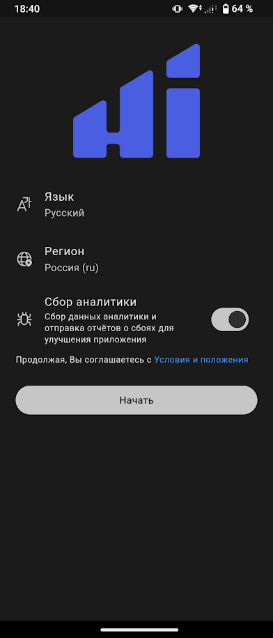
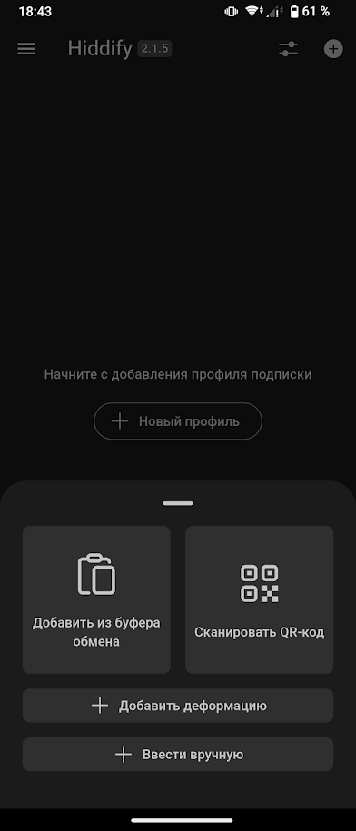
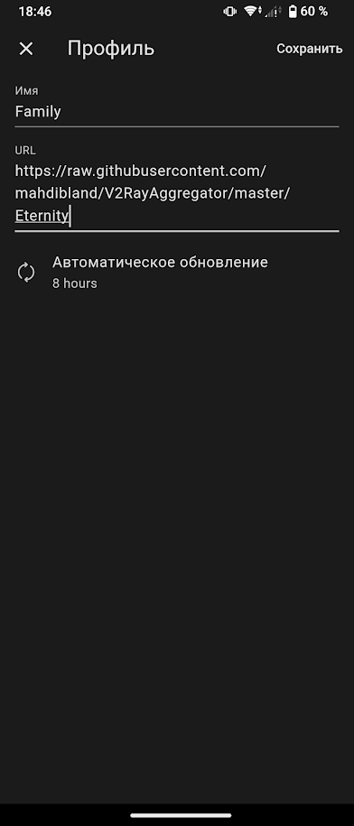
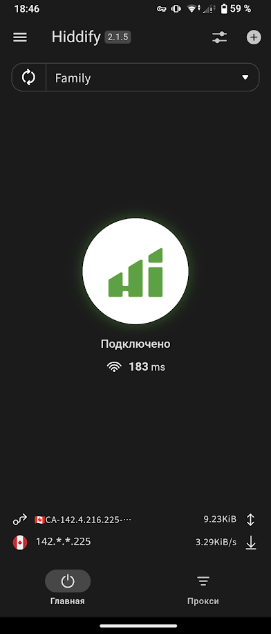

### Инструкция по настройке Hiddify на Android через подписку
1. Скачайте приложение Hiddify из Play Store https://play.google.com/store/apps/details?id=app.hiddify.com

> **_NOTE:_** Если скачать с Play Store не удается, можно скачать с github https://github.com/hiddify/hiddify-app/releases

2. Запустите Hiddify, установите регион и язык RU и нажмите `Начать`

3. Выберете `Новый профиль`, затем выберете `Ввести вручную`

4. Введите в поле `Имя` - название профиля (например `Family`), в поле `URL` - полученный от администратора URL, в поле `Автоматическое обновление` - `8` и нажмите `Сохранить` в правом верхнем углу экрана

5. Для подключения нажмите `большую круглую кнопку` по середине экрана. Может появиться запрос на подключение VPN, разрешите.

> **_NOTE:_** Hiddify автоматически выберет прокси сервер с наименьшей задержкой.

6. Настройка завершена.

> **_NOTE:_** Во многих оболочках Android есть возможность добавить кнопку для подключения/отключения прокси в "шторку уведомлений". Можете добавить её для удобства (работает схожим образом с переключателями Wi-Fi, Bluetooth, блокировкой автоповорота экрана, фонарика итп)

#### Маршрутизация
Hiddify автоматически исключает RU домены и RU IP адреса из проксирования (если при первоначальной настройке выбран регион `Россия`). Нет необходимости настраивать маршрутизацию вручную.
Есть возможность настроить проксирование в разрезе приложения (`Настройки` -> `Раздельное проксирование`)

#### Использование
##### Включение использования прокси
1. Запустите приложение Hiddify
2. Включите использование прокси нажатием `большой круглой кнопки` по середине экрана.

> **_NOTE:_** Если вы добавили кнопку для подключения/отключения прокси в "шторку уведомлений", нажатие на неё подключит/отключит использование прокси.

> **_NOTE:_** Если через прокси у Вас все работает как нужно, нет необходимости его отключать. Использование прокси незначительно увеличит расход заряда аккумулятора устройства.

> **_NOTE:_** При переключении между Wi-Fi и сотовой сетью возможна ситуация, в которой приложения, использующие прокси, не смогут подключиться к Интернет. В этом случае, перезапустите (выключите и включите) прокси.

##### Отключение использования прокси
1. Запустите приложение Hiddify.
2. Отключите использование прокси нажатием `большой круглой кнопки` по середине экрана.