### Инструкция по настройке Nekobox на Android через подписку 
1. Скачайте и установите клиент Nekobox по ссылке [arm64-v8a](https://github.com/MatsuriDayo/NekoBoxForAndroid/releases/download/1.3.4/NB4A-1.3.4-arm64-v8a.apk).

> **_NOTE:_** Если по ссылке выше не устанавливается, попробуйте скачать версию для [armeabi-v7a](https://github.com/MatsuriDayo/NekoBoxForAndroid/releases/download/1.3.4/NB4A-1.3.4-armeabi-v7a.apk).

2. Запустите приложение Nekobox
3. Перейдите с помощью меню слева (3 горизонтальные полосы) в раздел `Группы`

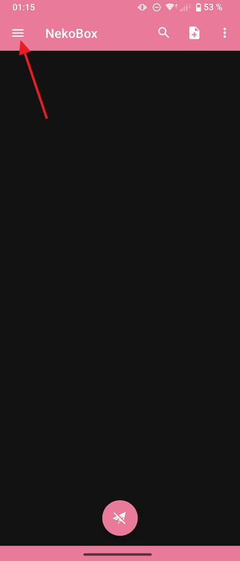

4. В разделе группы выберете `Создать группу` (иконка в правом верхнем углу)

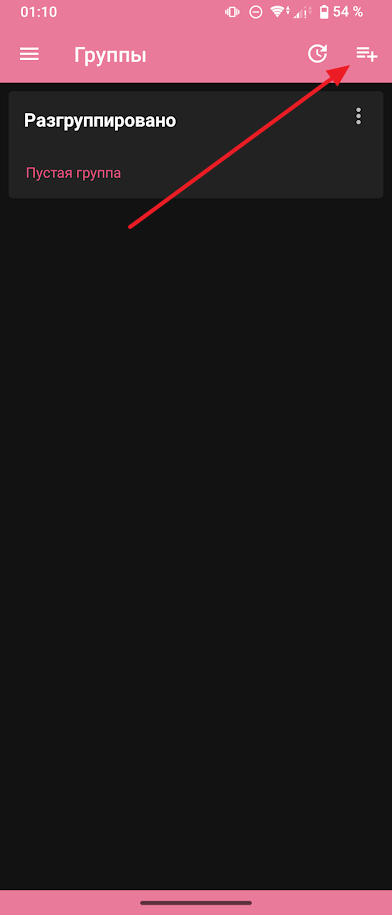

5. В настройках группы заполните поля:

| Название поля             | Значение поля                           |
| :------------------------ | --------------------------------------- |
| Имя группы                | Subscription                            |
| Тип группы                | Подписка                                |
| Сортировка                | По задержке                             |
| Ссылка для подписки       | _Эту ссылку Вам передаст администратор_ |
| Дедупликация              | `Включено`                              |
| Автоматическое обновление | `Включено`                              |

и подтвердите создание группы, нажатием `Применить` (галочка в правом верхнем углу).

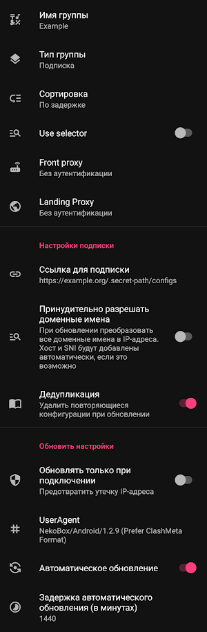

6. Перейдите с помощью меню слева (3 горизонтальные полосы) в раздел `Конфигурация`

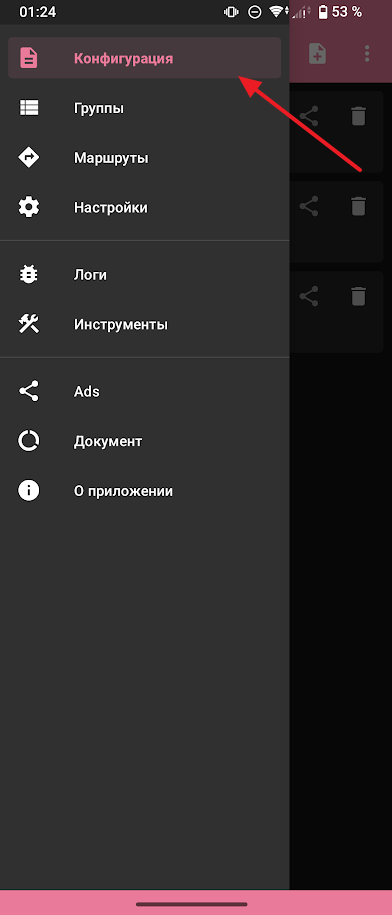

Вы увидите несколько профилей (1 или более). Каждый профиль - отдельный прокси сервер.  
Чтобы определить наиболее оптимальный с точки зрения скорости подключения прокси сервер, выполните `URL Test`, как показано на анимации ниже. 

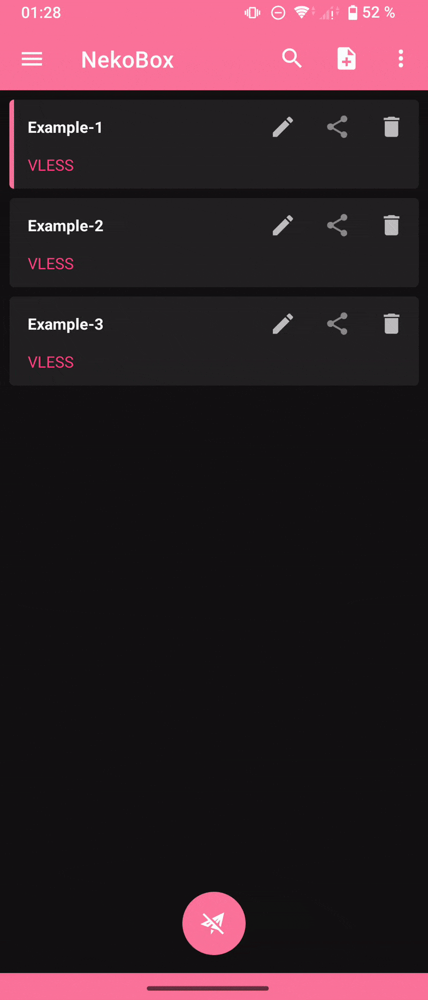

Чем меньше полученное число задержки в ms, тем сервер будет для Вас быстрее. 
> **_NOTE:_** Это число может меняться при переключении с Wi-Fi на мобильную сеть, при подключении к разным Wi-Fi сетям или перемещении между базовыми станциями сотового провайдера или просто со временем. В случае неудовлетворительной работы через прокси, рекомендуется повторить `URL Test` и выбрать другой сервер из списка. 
7. Для подключения к серверу, выберете его нажатием на строку с именем сервера, а затем нажатием на "круг с бумажным самолетом" внизу экрана.

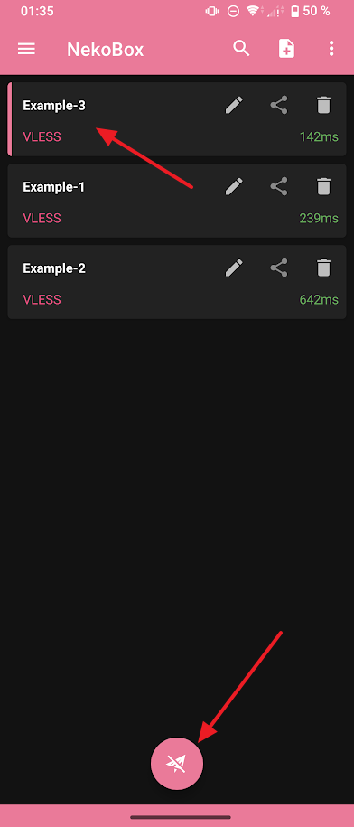 

> **_NOTE:_** Может появиться запрос на разрешение установки VPN соединения. Разрешите установку VPN соединения.
8. Для проверки успешности подключения к серверу, нажмите на розовую панель снизу. После нажатия на этой панели должно отобразиться сообщение `Успех: рукопожатие HTTP заняло XXX мс`. 

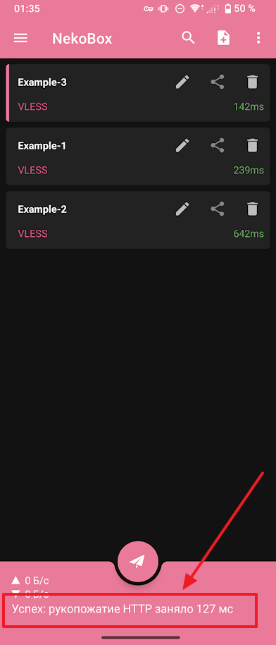

Если сообщение не появилось, значит сервер не работает (либо не работает только у Вас, например, блокируется Вашим интернет провайдером). В этом случае, выберете другой сервер. Если не работают все серверы:
   1. проверьте, что с Вашего устройства есть доступ в Интернет, путем загрузки страницы по адресу https://2ip.ru
   2. попробуйте переключиться с Wi-Fi на мобильную сеть или наоборот
   3. обратитесь к администратору

9. Настройте маршрутизацию. Если маршрутизация не будет настроена, для посещения сайтов в регионе RU потребуется отключать прокси. Это возможный, но менее удобный сценарий.
10.  Настройка завершена.
> **_NOTE:_** Во многих оболочках Android есть возможность добавить кнопку для подключения/отключения прокси в "шторку уведомлений". Можете добавить её для удобства (работает схожим образом с переключателями Wi-Fi, Bluetooth, блокировкой автоповорота экрана, фонарика итп)

#### Настройка маршрутизации
Как правило, прокси размещаются в другой стране, ввиду чего, доступ к ресурсам в Вашей стране через прокси может быть ограничен.
В случае, если маршрутизация не будет настроена, для посещения сайтов в регионе RU потребуется отключать прокси.
Требуется создать 3 правила в режиме "Обход":
1. RU домены
2. RU IP адреса
3. Приложения, которые используют только RU ресурсы (например банковские клиенты, rutube, VK итп)

Для настройки маршрутизации:
1. Перейдите с помощью меню слева (3 горизонтальные полосы) в раздел `Маршруты`.

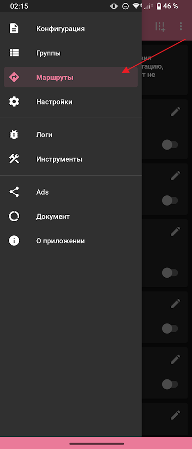

2. В разделе `Маршруты` выберете `Создать маршрут`.

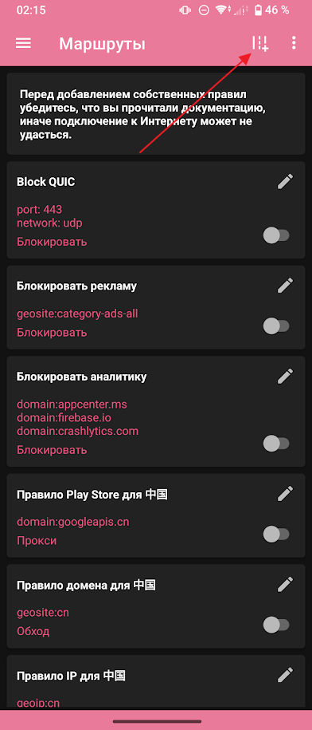

> **_NOTE:_** При создании маршрутов должны быть заполнены только те параметры, которые указаны в текущей инструкции. Все остальные параметры оставьте по умолчанию. Для подтверждения создания маршрута используйте кнопку `применить` в правом верхнем углу
3. Создайте маршрут для работы ru доменов НЕ через прокси с параметрами:

| Название параметра | Значение параметра  |
| :----------------- | ------------------- |
| Название маршрута  | ru Domain           |
| domain             | geosite:category-ru |
| outbound           | Обход               |

Пример на скриншоте

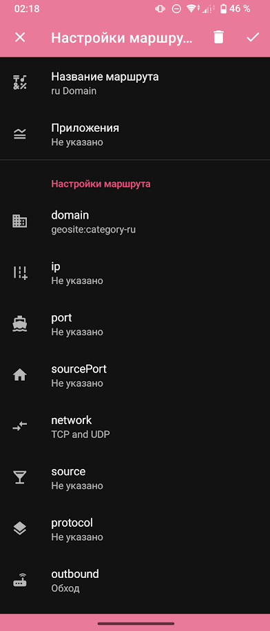

4. Создайте маршрут для работы ru IP адресов НЕ через прокси с параметрами:

| Название параметра | Значение параметра |
| :----------------- | ------------------ |
| Название маршрута  | ru IP              |
| ip                 | geoip:ru           |
| outbound           | Обход              |

Пример на скриншоте

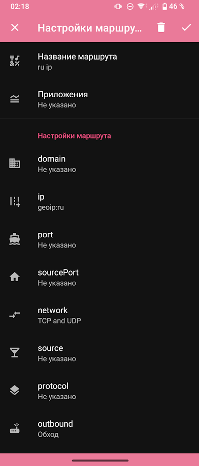

5. Создайте маршрут для работы некоторых приложений НЕ через прокси с параметрами:

| Название параметра | Значение параметра                         |
| :----------------- | ------------------------------------------ |
| Название маршрута  | ru Apps                                    |
| Приложения         | Альфа-Банк, Сбербанк (см. примечание ниже) |
| outbound           | Обход                                      |

Пример на скриншоте

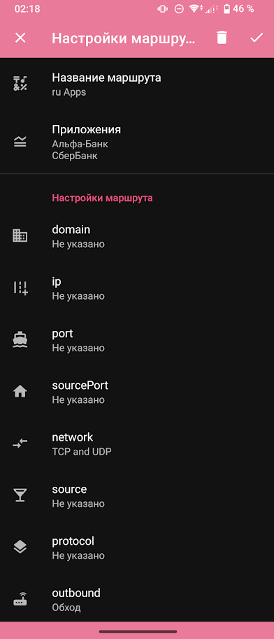

> **_NOTE:_** В этом маршруте Вы можете выбрать любые установленные на устройстве приложения по своему усмотрению.
Рекомендуется выбрать все приложения, которые используют ресурсы в RU сегменте сети, например: Приложения банков, Госуслуги, VK, rutube, Mir Pay, Яндекс карты и т. д.

6. Удалите все маршруты, кроме созданных на предыдущих шагах (если они Вам не нужны). Для удаления маршрута перейдите в меню редактирования маршрута (карандаш в правом верхнем углу карточки с маршрутом) и удалите его нажатием кнопки `удалить` (корзина в правом верхнем углу)
> **_NOTE:_** Правила в маршрутах применяются сверху вниз. Например, если существует два правила с одинаковым условием, но разными действиями, будет применяться правило, размещенное ниже в списке маршрутов.
7. Включите созданные маршруты (переключатель в правом нижнем углу карточки с маршрутом). По завершению настройки раздел `Маршруты` должен выглядеть следующим как на скриншоте.

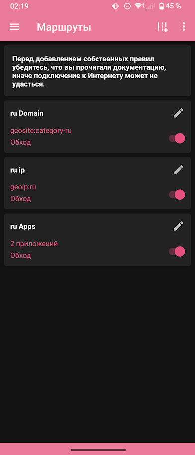

8. Перезапустите прокси (отключите и включите) после изменений маршрутов.
9. Настройка завершена.

#### Использование
##### Включение использования прокси
1. Запустите приложение Nekobox.
2. Выберете прокси из списка (перед запуском можно, но не обязательно выполнить `URL Test`).
3. Включите использование прокси нажатием на "круг с бумажным самолетом" внизу экрана.
> **_NOTE:_** Если вы добавили кнопку для подключения/отключения прокси в "шторку уведомлений", нажатие на неё подключит последний использованный прокси.

> **_NOTE:_** Если через прокси у Вас все работает как нужно, нет необходимости его отключать. Использование прокси незначительно увеличит расход заряда аккумулятора устройства.

> **_NOTE:_** При переключении между Wi-Fi и сотовой сетью возможна ситуация, в которой приложения, использующие прокси не смогут подключиться к Интернет. В этом случае, перезапустите (выключите и включите) прокси.

##### Отключение использования прокси
1. Запустите приложение Nekobox.
2. Отключите использование прокси нажатием на "круг с бумажным самолетом" внизу экрана.