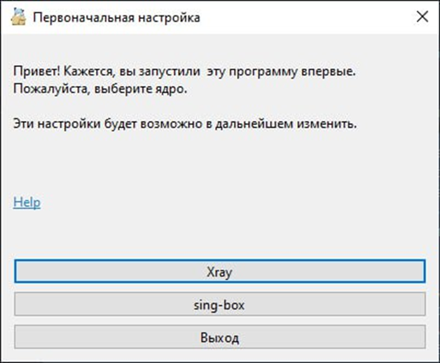
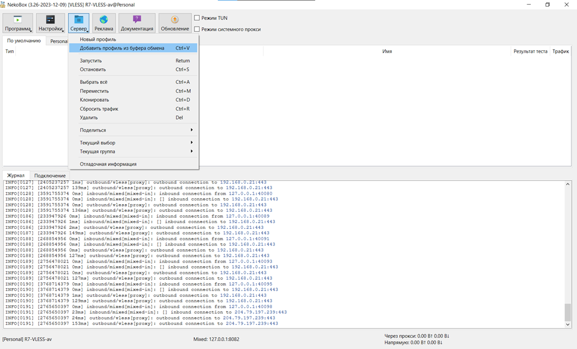
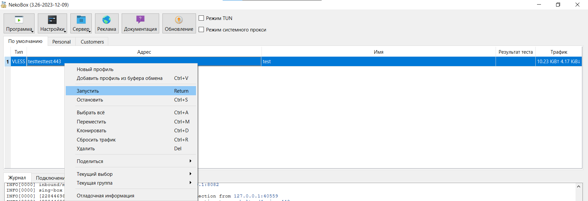

### Инструкция по настройке Nekobox на Windows с явным указанием строки подключения

1. Получите от администратора строку подключения к VPN.
Строка подключения выглядит примерно следующим образом
```
vless://ddae1fe3-6642-4493-a8b2-345767687@server.com:443?type=tcp&security=reality&pbk=tz7Ya8a3c4t234ct3c-PNQ65l4p34xtrzafasdfoSZhY&fp=chrome&sni=intel.com&sid=e6344f&spx=%2F#profile
```
2. Скачайте и распакуйте архив с  VPN клиентом по ссылке https://github.com/MatsuriDayo/nekoray/releases/download/3.26/nekoray-3.26-2023-12-09-windows64.zip .
3. Запустите nekoray.exe .
4. При первом запуске выберете ядро «sing-box».


5. Скопируйте строку с профилем подключения в буфер обмена, в главном окне Nekobox выберете «Сервер» -> «Добавить профиль из буфера обмена».


6. Нажмите правой кнопкой мыши по импортированному профилю и выберете "Запустить".


7. Выберете режим работы: "Режим TUN" или "Режим системного прокси". Для большинства задач рекомендуется выбрать режим системного прокси.
8. Запустите браузер и убедитесь, что VPN/прокси расширения в браузере, такие как, например, Hola VPN, отключены.
9. Откройте в браузере https://2ip.ru и проверьте, что VPN/прокси работает. В графе "Ваше местоположение" вы должны увидеть страну, отличную от вашего текущего местоположения.
10. Настройка завершена.